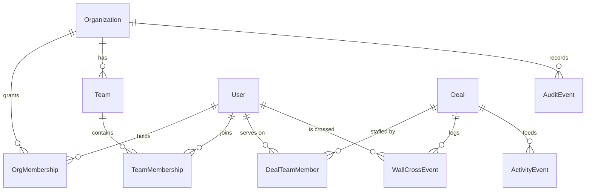
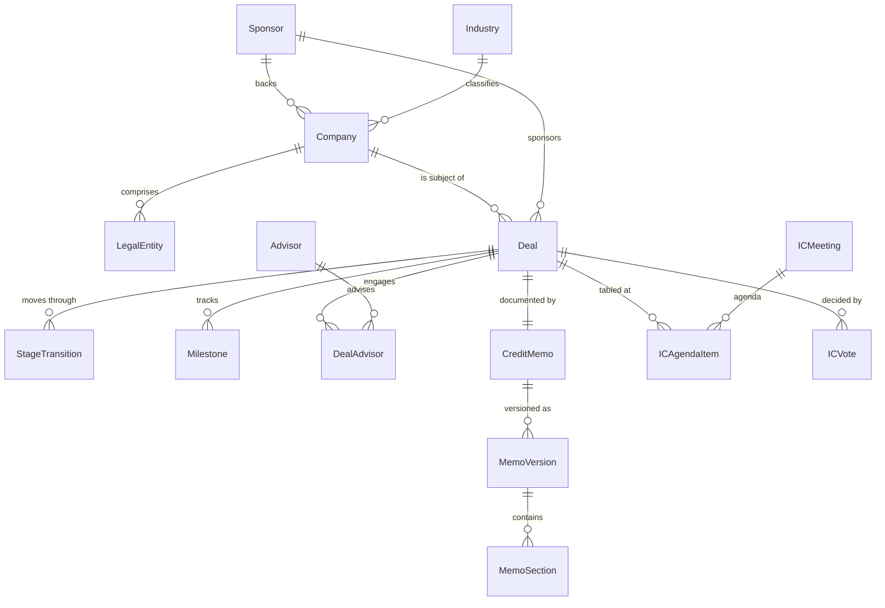
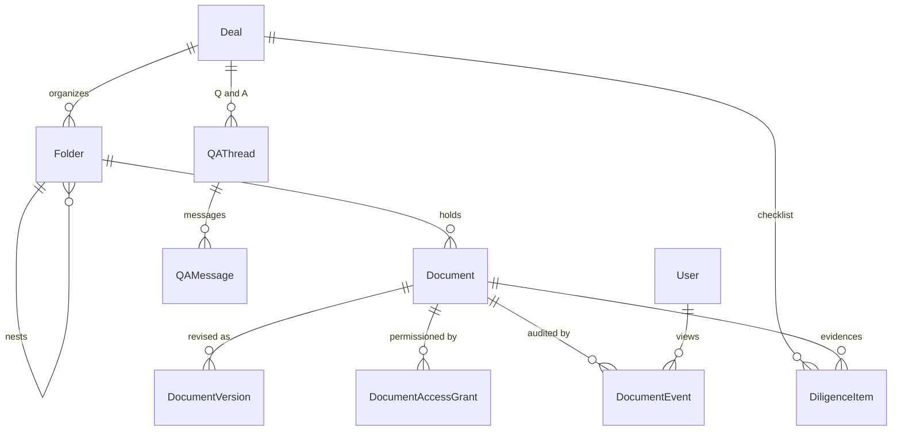
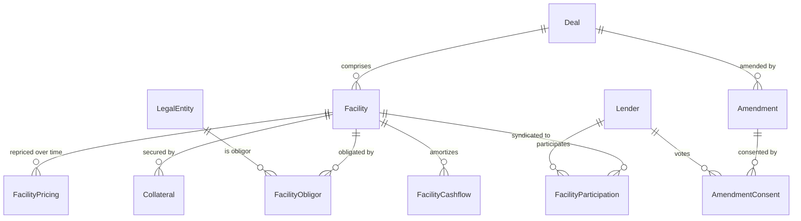
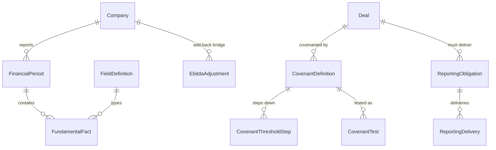
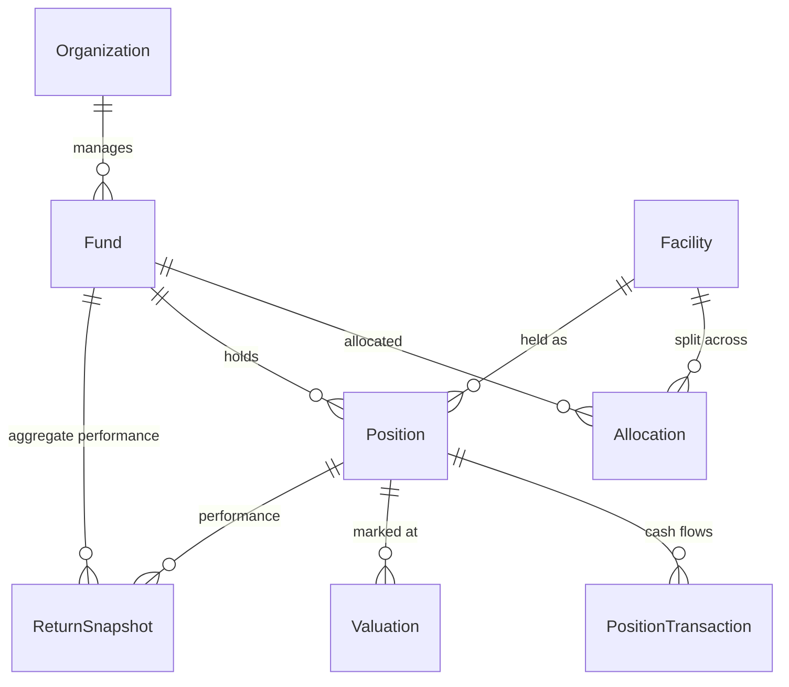

# Canonical Data Model — Private Credit Deal Room & Dashboard

A clean-slate reference model covering everything a deal room dashboard needs:
**identity & access**, **counterparties**, **pipeline**, **data room**,
**structuring & syndication**, **covenant monitoring**, **fund/position
economics**, and the **time-series history** that dashboard analytics depend on.

- **Schema:** [`schema.canonical.prisma`](./schema.canonical.prisma) — 68 models, 39 enums, validated.
- **XSD view:** [`schema.canonical.xsd`](./schema.canonical.xsd) — the same model as XML Schema,
  generated from the Prisma file. Often the faster read: types, enums and foreign keys are all
  spelled out in one place. See [§8](#8-xsd-view).
- **Target:** PostgreSQL (native enums, `Decimal` money, composite indexes, `String[]`, `Json`).
- **Status:** design artifact. It is deliberately *separate* from the running app schema
  (`prisma/schema.prisma`) and generates to its own client output, so it cannot clobber
  the live client. Nothing in the running app changes.

```bash
CANONICAL_DATABASE_URL="postgresql://u:p@localhost:5432/canonical" \
  npx prisma validate --schema=docs/data-model/schema.canonical.prisma
```

---

## Table of contents
1. [Design principles](#1-design-principles)
2. [Domain map](#2-domain-map)
3. [Entity–relationship diagrams](#3-entityrelationship-diagrams)
4. [Entity catalog](#4-entity-catalog)
5. [Dashboard completeness matrix](#5-dashboard-completeness-matrix)
6. [What this changes vs. the current schema](#6-what-this-changes-vs-the-current-schema)
7. [Adoption path](#7-adoption-path)
8. [XSD view](#8-xsd-view)

---

## 1. Design principles

Five rules drive most of the structural differences from a naive model.

| # | Principle | Why it matters |
|---|---|---|
| 1 | **Money is `Decimal(20,4)`, never `Float`** | Float silently loses pennies when summing a portfolio. Ratios use `Decimal(18,6)`, percentages `Decimal(9,4)`. |
| 2 | **Anything trended is an event table, not a mutable scalar** | A dashboard cannot chart what the database overwrites. Stage, rating, pricing, marks and document versions are all append-only histories. |
| 3 | **Every actor is a `User` FK** | Free-text `uploadedBy`/`assignee`/`actor` strings cannot be filtered, permissioned, or attributed. |
| 4 | **Multi-tenant by `orgId` on root aggregates** | Org scoping at the aggregate root keeps every dashboard query naturally partitioned. |
| 5 | **Amounts travel with a currency; FX is first-class** | A single-currency assumption is unpickable later. |

Two further choices are worth calling out:

- **Facts over columns.** `FinancialPeriod` holds period *metadata*; the values live in
  `FundamentalFact` keyed by a governed `FieldDefinition`. Tracking a new metric never
  requires a schema migration, and every field declares its `aggregation`
  (`FLOW` / `STOCK` / `DERIVED`) so LTM-vs-calendar roll-ups are computable rather than assumed.
- **`Position`, not `Deal`, is the unit of economics.** A deal is a transaction; a position
  is a fund's holding in a facility. Exposure, marks and returns roll up from positions,
  which is what makes multi-fund/SPV allocation representable at all.

---

## 2. Domain map

| # | Domain | Models | Core entities |
|---|---|---:|---|
| 1 | Identity, access & audit | 9 | `Organization` `User` `OrgMembership` `Team` `DealTeamMember` `WallCrossEvent` `AuditEvent` `ActivityEvent` |
| 2 | Counterparties & obligors | 6 | `Sponsor` `Company` `LegalEntity` `Industry` `Advisor` `Contact` |
| 3 | Deal & pipeline | 8 | `Deal` `StageTransition` `Milestone` `ICMeeting` `ICVote` `CreditMemo` `MemoVersion` |
| 4 | Collaboration | 3 | `Task` `Note` `Comment` |
| 5 | Data room & diligence | 7 | `Folder` `Document` `DocumentVersion` `DocumentAccessGrant` `DocumentEvent` `DiligenceItem` `QAThread` |
| 6 | Facilities & syndication | 9 | `Facility` `FacilityPricing` `FacilityObligor` `Collateral` `Lender` `FacilityParticipation` `Amendment` `AmendmentConsent` `FacilityCashflow` |
| 7 | Financials & covenants | 9 | `FieldDefinition` `FinancialPeriod` `FundamentalFact` `EbitdaAdjustment` `CovenantDefinition` `CovenantThresholdStep` `CovenantTest` `ReportingObligation` `ReportingDelivery` |
| 8 | Funds, positions & returns | 6 | `Fund` `Allocation` `Position` `PositionTransaction` `Valuation` `ReturnSnapshot` |
| 9 | Risk, alerts & reference data | 8 | `RatingHistory` `WatchlistEvent` `KpiSnapshot` `Alert` `SavedView` `ReferenceRate` `FxRate` `MarketComp` |

---

## 3. Entity–relationship diagrams

Split by domain — one diagram for 68 models would be unreadable.

### 3.1 Identity, access & the information barrier



### 3.2 Counterparties, pipeline & IC



### 3.3 Data room & diligence



### 3.4 Facilities, syndication & amendments



### 3.5 Financials, facts & covenants



### 3.6 Funds, positions & returns



---

## 4. Entity catalog

Selected entities where the modeling decision is non-obvious. (Names are self-explanatory
for the rest; the schema file carries inline commentary on every one.)

| Entity | Purpose | Notable fields / constraints |
|---|---|---|
| `WallCrossEvent` | Immutable record of crossing/de-crossing the information barrier | `crossed`, `subject`, `approver`, `reason`; `DealTeamMember.isWallCrossed` is the denormalized current state |
| `AuditEvent` | Append-only audit with before/after payloads | `action`, `entityType`, `entityId`, `before`/`after` `Json` |
| `LegalEntity` | Borrowers, guarantors, pledgors — the credit group | self-referencing `EntityTree`; distinct from the operating `Company` |
| `StageTransition` | Every pipeline stage change | `fromStage`, `toStage`, `daysInPrior` denormalized for cheap velocity math |
| `MemoVersion` / `MemoSection` | Real memo version history | `@@unique([memoId, versionNo])`; `CreditMemo.currentVersionId` points at the live one |
| `DocumentVersion` | Real file versions | `checksum`, `storageKey`, `extractedText` (search + AI grounding) |
| `DocumentAccessGrant` | Deny-by-default access to a doc *or* folder, for a user *or* team | `canView`/`canDownload`, `expiresAt` |
| `DocumentEvent` | View/download/print audit trail | the record LPs and regulators ask for |
| `FacilityPricing` | Effective-dated pricing | repricings and ratchets are history; live terms = latest `effectiveFrom` |
| `FacilityParticipation` | Syndicate holdings | `agentRole`, per-lender `commitment`/`funded` |
| `AmendmentConsent` | Consent tracking with threshold math | `weightPct` per consenting lender vs `Amendment.requiredConsentPct` |
| `FieldDefinition` | Governed field vocabulary | `aggregation` (FLOW/STOCK/DERIVED), `bloombergMnemonic`, `deriveFormula` |
| `FundamentalFact` | Every financial value, by field & period | `@@unique([companyId, periodEnd, fieldCode, source])` — sources layer, overrides win |
| `EbitdaAdjustment` | GAAP→Adjusted bridge | `isCapped`/`isUncapped`/`isAggressive` let the permitted amount be *computed*, so the cap binds |
| `CovenantThresholdStep` | Step-down schedule as rows | queryable and chartable, unlike a JSON blob |
| `CovenantTest` | One test, both numbers | `recomputedValue` vs `reportedValue` + `reconDelta`; `formulaSnapshot` makes the math auditable |
| `Position` | A fund's holding in a facility | the unit exposure, marks and returns roll up from |
| `PositionTransaction` | Dated, signed cash flows | the XIRR input; realized/unrealized split |
| `KpiSnapshot` | Generic metric time-series | `@@unique([orgId, asOf, scopeType, scopeId, metric])` — new tiles need no new tables |
| `Alert` | Dashboard alert inbox | `dedupeKey` so a recurring condition updates one alert instead of spamming |
| `SavedView` | Per-user dashboard filters/layout | `route` + `filters` `Json` |

---

## 5. Dashboard completeness matrix

The test of "captures all the information needed": every widget a deal room dashboard
would show, mapped to the entities that serve it.

| Dashboard widget | Backed by |
|---|---|
| Pipeline funnel by stage | `Deal.stage` |
| Pipeline **velocity / cycle time** | `StageTransition.daysInPrior` |
| Conversion & win/loss rates | `StageTransition` + `Deal.status` |
| Deal flow by sponsor / channel | `Deal.channel`, `Sponsor` |
| Probability-weighted pipeline | `Deal.probability`, `Deal.targetHold` |
| Committed vs funded capital | `Facility.commitment/fundedAmount`, `Position` |
| Exposure by sector / sponsor / fund | `Position` → `Facility` → `Deal` → `Company.industry`, `Fund` |
| Portfolio marks & NAV | `Valuation` (position-level) |
| IRR / MOIC tiles | `PositionTransaction`, `ReturnSnapshot` |
| Cash-flow forecast | `FacilityCashflow` (`isProjected`) |
| Covenant status heatmap | `CovenantTest.status` |
| Covenant headroom trend vs step-downs | `CovenantTest.headroomPct`, `CovenantThresholdStep` |
| Reconciliation exceptions | `CovenantTest.reconDelta` + `RECON_FLAG` |
| Adjusted-EBITDA quality / cap breach | `EbitdaAdjustment.isCapped/isUncapped/isAggressive` |
| Reporting calendar & late filings | `ReportingObligation`, `ReportingDelivery` |
| Watchlist | `WatchlistEvent` |
| **Rating migration matrix** | `RatingHistory` |
| Amendment pipeline & consent progress | `Amendment`, `AmendmentConsent` |
| Syndicate / hold-level exposure | `FacilityParticipation`, `Lender` |
| Collateral coverage | `Collateral`, `FacilityObligor` |
| Data room activity & stale docs | `DocumentEvent`, `DocumentVersion` |
| DDQ completion | `DiligenceItem.status` |
| Open Q&A with sponsor | `QAThread`, `QAMessage` |
| IC calendar, outcomes & vote tally | `ICMeeting`, `ICAgendaItem`, `ICVote` |
| Memo status / who edited what | `CreditMemo`, `MemoVersion` |
| My tasks & overdue items | `Task` |
| Alerts inbox | `Alert` |
| Recent activity feed | `ActivityEvent` |
| Compliance: wall-crossings & access review | `WallCrossEvent`, `DocumentAccessGrant`, `AuditEvent` |
| Pricing context vs market | `MarketComp`, `ReferenceRate` |
| Multi-currency roll-up | `Currency` + `FxRate` |
| Saved filters / personalized layout | `SavedView` |
| Fast KPI tiles & sparklines | `KpiSnapshot` |

---

## 6. What this changes vs. the current schema

The running app (`prisma/schema.prisma`, 25 models) covers deal execution and covenant
monitoring well. This model closes the structural gaps.

| Current | Canonical | Why |
|---|---|---|
| `DealTeamMember.name`, `uploadedBy`, `assignee`, `ActivityLog.actor` as **strings** | `User` + `OrgMembership` + FK everywhere | attribution, filtering and permissions are impossible on free text |
| `DealTeamMember.wallCrossed` boolean | `WallCrossEvent` stream | compliance needs *when*, *by whom*, *why* |
| `Document.version` **integer** | `DocumentVersion` rows + `DocumentEvent` + `DocumentAccessGrant` | no history, no audit, no per-user access today |
| `Deal.stage` **scalar** | `StageTransition` | pipeline velocity is uncomputable from an overwritten field |
| `Borrower.riskRating` / `watchlist` **scalars** | `RatingHistory`, `WatchlistEvent` | rating migration needs history |
| `Valuation` hangs off **Borrower** | `Valuation` on **`Position`** | marks belong to a holding, not a company |
| *(absent)* | `Fund`, `Allocation`, `Position`, `PositionTransaction`, `ReturnSnapshot` | no portfolio/fund layer exists today |
| *(absent)* | `Lender`, `FacilityParticipation`, `Collateral`, `FacilityObligor` | no syndicate, collateral or obligor structure |
| `LifecycleEvent` (generic) | `Amendment` + `AmendmentConsent` | consent thresholds and voting need structure |
| Money as **`Float`** | `Decimal(20,4)` | precision |
| Enums as **`String`** | native Postgres enums | integrity |
| `thresholdSchedule` **JSON blob** | `CovenantThresholdStep` rows | queryable, chartable |
| `FinancialStatement` **fixed columns** | `FinancialPeriod` + `FundamentalFact` + `FieldDefinition` | new metrics without migrations; explicit FLOW/STOCK aggregation |
| Facility pricing **scalars** | `FacilityPricing` effective-dated | repricings are history |
| *(absent)* | `Alert`, `KpiSnapshot`, `SavedView`, `FxRate`, `ReferenceRate`, `MarketComp`, `Industry`, `LegalEntity`, `Contact`, `Advisor`, `QAThread`, `Comment`, `Milestone`, `ICMeeting` | dashboard, reference-data and collaboration surface |

Carried forward largely intact (the covenant engine work): `CovenantDefinition`,
`CovenantTest` with recompute-vs-reported reconciliation, `FundamentalFact`,
`EbitdaAdjustment` with a binding cap, and `ReportingObligation`/`ReportingDelivery`.

---

## 7. Adoption path

This is a design artifact — adopting it is a real migration, not a drop-in. A sane order:

1. **Postgres + money/enum types.** Move off SQLite; `Float`→`Decimal`, `String`→native enums.
   Mechanical, and unblocks everything else.
2. **Identity.** Introduce `User`/`Organization`/`OrgMembership`; backfill the name strings
   to FKs; replace the simulated role cookie with real membership + `DealTeamMember`.
3. **History tables.** Add `StageTransition`, `RatingHistory`, `DocumentVersion`,
   `FacilityPricing`; backfill one row per current scalar value, then start appending.
4. **Fund/position layer.** Add `Fund`/`Position`/`PositionTransaction`; re-point `Valuation`
   from `Borrower` to `Position`. This is the largest behavioral change — portfolio and
   returns views move from deal-level to position-level roll-ups.
5. **Remaining surface** (syndication, collateral, amendments, alerts, KPI snapshots) as
   the corresponding dashboard widgets are built.

Steps 1–3 are additive and low-risk. Step 4 changes how exposure and returns are computed,
so it wants its own migration + reconciliation against current numbers.

---

## 8. XSD view

[`schema.canonical.xsd`](./schema.canonical.xsd) is the same model expressed as
XML Schema. It exists because an XSD reads as one flat, annotated list — every
type, every enumeration and every foreign key in a single file — which is easier
to skim than a relational schema plus a set of diagrams.

It is **generated, not hand-written**, so the two files cannot drift:

```bash
node docs/data-model/generate-xsd.mjs          # or: npm run docs:xsd
```

| | |
|---|---|
| Target namespace | `urn:lumen:private-credit-deal-room:1.0` |
| Document element | `DealRoomDataset` — one optional collection per entity type |
| Contents | 68 `xs:complexType` entities · 39 `xs:simpleType` enumerations · 69 `xs:key` · 121 `xs:keyref` |

### How the Prisma model maps onto it

| Prisma | XSD | Note |
|---|---|---|
| `model Foo` | `<xs:complexType name="Foo">` | Fields in declaration order, inside `xs:sequence`. |
| `enum Bar` | `<xs:simpleType name="Bar">` | `xs:restriction` on `xs:string` with one `xs:enumeration` per value. |
| Relation field (`deal Deal @relation(...)`) | *omitted* | A navigation, not data. The scalar FK it maps to is what appears. |
| Scalar FK (`dealId String`) | `<xs:element name="dealId" type="pc:Cuid">` + `xs:keyref` | So validation checks referential integrity, not just shape. |
| `Decimal @db.Decimal(20,4)` | `pc:Money` | Named simple types carry `totalDigits`/`fractionDigits`: `Money` (20,4), `Ratio` (18,6), `Percent` (9,4), `MetricValue` (24,6), `RatePercent` (9,6), `FxFactor` (18,8). |
| `Json` | `pc:Json` | Mixed content — carry the JSON as text, or as lax-validated child elements. |
| `String[]` | repeating element, `minOccurs="0" maxOccurs="unbounded"` | |
| `?` | `minOccurs="0"` | |
| `@default(x)` | `default="x"` plus a note in `xs:documentation` | Function defaults (`now()`, `cuid()`) are omitted — they are write-path concerns. |
| `///` doc comments and trailing `//` notes | `xs:documentation` | This is most of what makes the XSD readable. |
| `@@unique([...])` | noted in the type's `xs:documentation` | XSD 1.0 cannot express a composite uniqueness constraint scoped to a collection, so it is documented rather than enforced. |

### Verifying it

[`example-instance.xml`](./example-instance.xml) is a small worked example — one
sponsor-backed unitranche deal followed from origination to a covenant test that
trips the reconciliation flag, plus the fund position and mark it rolls up to.
Validating it compiles the schema and exercises every `xs:keyref`, so it doubles
as the regression test for both files:

```bash
cd docs/data-model
xmllint --noout --schema schema.canonical.xsd example-instance.xml
# example-instance.xml validates
```

Constraints that actually bite, verified by mutating that file:

| Mutation | Result |
|---|---|
| Point `dealId` at a deal that isn't in the document | `No match found for key-sequence ['deal_typo'] of keyref 'fk_Facility_dealId'` |
| Set a `CovenantTest.status` of `PROBABLY_FINE` | `not an element of the set {'PASS', 'NEAR_BREACH', 'BREACH', 'RECON_FLAG', …}` |
| Give a `Ratio` seven decimal places | `has more fractional digits than are allowed ('6')` |

### Limits worth knowing

- **Order matters.** `xs:sequence` mirrors column order, so instance elements must
  appear in the order the type declares. That is deliberate — it documents the
  canonical shape — but it means hand-written XML needs the order right.
- **Composite unique keys are documentation only** (see the mapping table above).
- **Cross-document references are not checked.** `xs:keyref` is scoped to one
  document, so a partial extract must include the rows it points at, or leave the
  optional FK element out entirely.
- **`Decimal` bounds are structural, not semantic.** `Percent` (9,4) is reused by a
  few fields that hold small multiples rather than percentages (notably
  `ReturnSnapshot.moic`); the field's own `xs:documentation` is authoritative.
